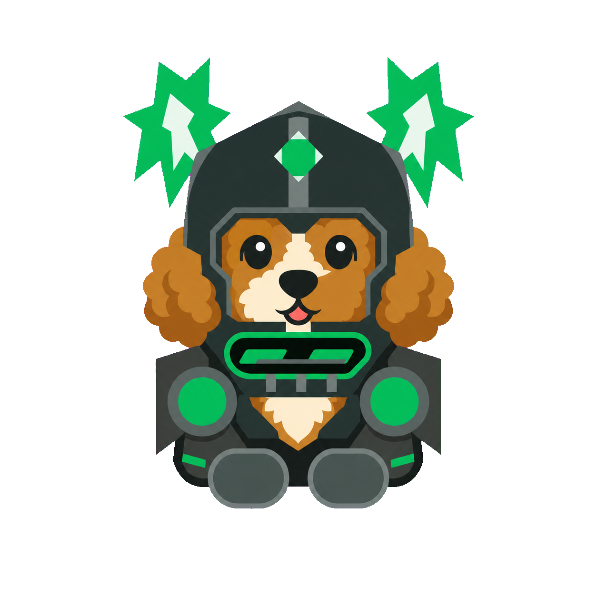

# Prompt Lift 🐾

> 一个会住在 Windows 任意输入框旁边的安全表达助手：双击一下 `Alt`，让想法更清楚，让语气更合适，让提示词更好用。

Prompt Lift 不是一个需要你切换窗口的“聊天机器人”，而是一只随时待命的小精灵。它读取当前输入框里的文字，交给模型做一次有边界的优化，再由你决定预览、复制、应用、重试还是恢复原文。

## 它能帮你做什么？

Prompt Lift 当前把“表达目标”分成四类，每一类都有自己的优化策略和档位：

| 场景 | 适合内容 | 优化重点 |
| --- | --- | --- |
| **AI 提示词** | 写给 AI 的任务说明 | 补齐目标、上下文、约束、验收标准和输出格式，但不替你执行原任务 |
| **向上沟通** | 给老板、负责人或跨团队伙伴发消息 | 先说结论，再整理依据、风险、需要的支持和下一步 |
| **用户沟通** | 客服、运营、销售和日常对外表达 | 更安全、更礼貌、更清晰，避免过度承诺和模糊措辞 |
| **PPT 文案** | 优化一段标题或正文 | 把描述性标题改成结论型标题，压缩正文并建立信息层级 |

四档风格不是“同一段话换个名字”，而是不同的编辑力度：

- **原意守护**：尽量不改写，只修正明显歧义、错别字和必要结构。
- **清晰直达**：删掉绕口表达，突出结论，适合高频快速发送。
- **专业展开**：补齐逻辑、条件、风险与行动项，适合正式沟通和复杂提示词。
- **创意策划**：在事实不变的前提下，提供更有记忆点的结构、标题或表达方式。

## 主要功能

- **快捷键即用**：默认双击左 `Alt`，也可在“我的 → 全局快捷键”录制自定义组合键。
- **预览后再决定**：可开启“审阅后应用”，先看结果、恢复原文、重新生成或复制，再手动应用。
- **安全替换**：应用前会核对目标窗口、进程、原始文本和操作令牌；输入框内容被别人改过时，不会盲目覆盖。
- **可撤销可恢复**：原文只保留在当前操作链路中，取消或恢复都不会悄悄丢字。
- **一个表达设置区**：主界面只保留一个优化动作；“表达场景”和“优化档位”合并为同一组两行设置，场景选项进入单列子页，选中后自动返回，不再重复铺设卡片或占用独立页签。
- **直接、肯定地表达任务**：AI 提示词模式会把明确的任务和下一步写成可直接执行的要求；模型擅自追加“是否需要我继续”等请示句时，结果会被拦截并自动纠正一次。
- **不伪造“已经做完”**：待审计、待检查、待开发的请求会保持未完成状态；仓库链接、文件路径和截图只是待检查对象，不能被模型当成已访问证据或虚构发现。
- **系统提示词透明可调**：在“系统提示词”页切换场景与档位，可查看 4 种场景 × 4 个档位各自专属的当前规则；页面只保留一份可折叠的只读提示词和一份自定义补充规则，不再重复展示相同内容。
- **快捷键冲突保护**：保存自定义快捷键时先尝试注册；若被系统或其他应用占用，保留原快捷键并给出提示。
- **三个小精灵**：原始可卡布犬、绿色骑士小狗、CSS 绿色骑士。绿色骑士小狗已校准脸部毛色，使用透明无边框切图，并通过轻微呼吸、好奇侧身和耳朵微动增加可爱待机表现。
- **桌面精灵可缩放**：鼠标移到桌面精灵右上角的三个轻量圆点即可拖动改变大小；小狗、圆点和状态条会作为一个整体等比响应，并限制在安全尺寸内。角色会持续填满可用空间，外围透明像素不再拦截底层应用点击；拖动期间复用稳定绘制面，松手后才恢复精准命中区域，避免连续拉伸时闪烁。
- **更少的页签**：底部只保留“处理 / 我的”，“模型与 Key”“检查模型配置”“开机自启动”等原服务内容统一收进“我的”。
- **极简扁平界面**：轻量的中性底色、克制的绿色强调和清楚的层级，不用厚重渐变或花哨动画抢走输入焦点。

## Windows 运行方式

### 推荐：下载完整 ZIP

1. 在仓库文件列表中下载唯一的最新版 [Prompt-Lift-latest-win32-x64.zip](deliverables/Prompt-Lift-latest-win32-x64.zip)，可用同目录的 [SHA256SUMS.txt](deliverables/SHA256SUMS.txt) 校验完整性。
2. 将 ZIP 解压到一个有写入权限的目录。
3. 先退出系统托盘里已经运行的旧版 Prompt Lift。
4. 双击解压目录中的 `Prompt Lift-win32-x64/Prompt Lift.exe`。

这是一个 Windows x64 便携包，已经包含运行时，不需要额外安装 Node.js、npm 或命令行工具。**不要只把 EXE 单独拎出来运行**，请保留它旁边的整个 `Prompt Lift-win32-x64` 文件夹。

仓库只保留一个最新版 ZIP，不再提交解压后的 Electron 运行目录、历史版本包或自动化截图；这样源码更容易阅读，下载入口也不会混淆。

### 第一次使用

1. 打开任意可以输入文字的 Windows 应用，把光标放进输入框。
2. 双击左 `Alt`，或直接单击桌面小精灵。
3. 首次使用先进入“模型与 Key 配置”，填写兼容 Chat Completions 的接口地址、模型名和 API Key，并点击“检查并保存”。
4. 在首个“处理”页点击“表达场景”，从单列列表中选择 AI 提示词、向上沟通、用户沟通或 PPT 文案；返回后在同一“表达设置”区域选择对应优化档位。底部导航只保留“处理 / 我的”。
5. 如需更换快捷键，进入“我的 → 全局快捷键”，点击“录制新的组合键”，按下至少两个修饰键和一个主按键后保存。
6. 结果出现后，可以直接应用，也可以打开审阅流程后再复制、重新生成、恢复原文或放弃。

API Key 通过 Electron 的 Windows `safeStorage` 加密保存，只对当前 Windows 用户可用，不会写进源码、日志或打包资源。模型请求失败时，原文不会被替换。

## PPT 文案场景的边界

PPT 文案场景适合把当前输入的一段标题或正文整理成“一个结论 + 清晰层级”的文案。它不会假装读取整个演示文稿，也不会凭空理解其他文本框、图表、备注或版式；如果需要整套 PPT 改稿，请先把需要处理的文字汇总到当前输入框。

## 开发与技术栈

- Electron + Node.js
- 原生 HTML / CSS / JavaScript 渲染界面
- Windows 原生输入捕获与原子化替换桥接
- Electron `safeStorage` 保护模型凭据
- 版本化 Recipe 与模型侧系统提示词协议
- Git LFS 管理便携版 EXE 和 ZIP 发布文件

本项目的核心原则是“先保护原文，再谈增强”：输入内容按不可信材料传给模型，系统规则优先于模式、档位和用户文本；结果必须满足严格的协议、语言和不可变锚点校验后，才允许进入替换流程。

## 本地开发

```powershell
npm install
npm start
npm test
npm run check
npm run package:win
```

当前版本的自动化回归为 **238/238 通过**，提示词边界循环为 **24/24 通过**；真实模型契约确认模型不会擅自追加继续开发的请示句，新增回归同时阻止“待审计”被改成“已完成审计”以及清楚任务被追加非阻塞确认问题。Windows 界面验收覆盖 **85 个状态、205 次可信点击和 217 次可信手势**，包含 16 组场景 × 档位提示词切换、单滚动提示词页、双页签导航、语义图标、小狗待机动画、紧凑视觉簇缩放、拉伸期间原生形状合并更新、透明区域点击穿透以及默认双击 Alt 等关键路径；几何缺陷与流程缺陷均为 0。

本地打包结果写入 `release/`；仓库只发布一个可下载便携包和一个校验文件：

```text
deliverables/Prompt-Lift-latest-win32-x64.zip
deliverables/SHA256SUMS.txt
```

## 目录速览

```text
src/core/                 提示词 Recipe、协议与模型调用
src/main.mjs              Electron 主进程和 Windows 桥接
src/renderer/             小精灵界面、菜单与交互
src/renderer/assets/      可卡布犬与绿色骑士小狗透明素材
scripts/                  打包、契约检查和视觉验收脚本
test/                     单元测试与产品契约测试
deliverables/              当前 Windows x64 便携包
```

`qa/evidence/`、`release/`、临时目录和解压后的运行时均由本地验收生成，不进入 GitHub；需要追溯历史发布时仍可从 Git 提交历史查看旧版本。

## 欢迎一起把表达变好

欢迎提交 Issue 或 Pull Request：可以是一个 badcase、一条更好的提示词样例、一次界面改进，或者一只更可爱的透明小精灵。提交代码前请至少运行：

```powershell
npm test
npm run check
```

如果你发现结果不符合预期，请附上原始输入、选择的场景/档位和模型返回的结果；不要上传 API Key、真实客户隐私或敏感业务内容。

---



愿每一次发送，都比刚才更清楚一点。✨
