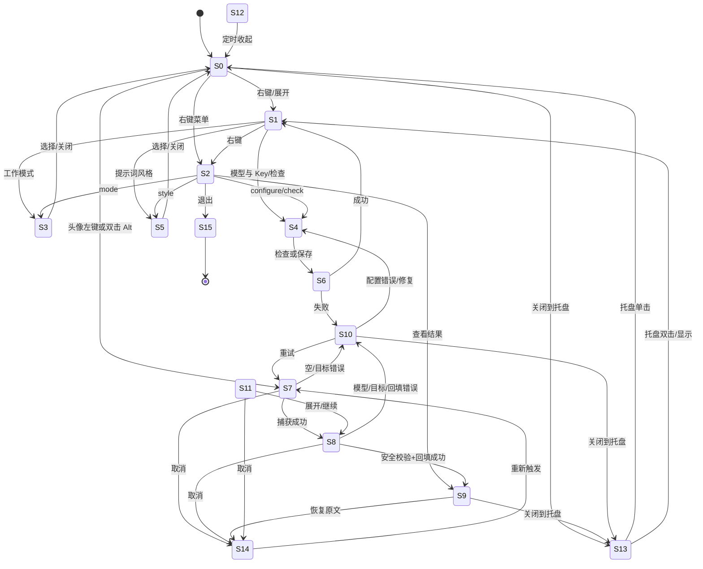

# Prompt Lift 需求追踪矩阵与界面状态图

> 状态：仅设计，未执行。日期：2026-08-03。矩阵把项目规范、README、现有测试覆盖和新增实机 P0 需求映射到 `qa/MASTER_TEST_PLAN.md` 的 72 个用例；不代表任何用例已经运行。

## 1. 追踪矩阵

“自动”只表示可由静态、Node、mock、CDP 或报告生成器判定；“人工/真实桌面”表示必须在 Windows/Electron 或真实目标应用中执行。真实模型列为“是”的用例只能读取用户已经由 Electron `safeStorage` 加密保存的配置，Key 输入框保持空白，不得在测试代码、命令、报告或日志出现。

| 需求/历史问题 | P | 自动/人工 | 真实桌面 | 真实模型 | 覆盖用例 | 验收要点 |
|---|---|---|---|---|---|---|
| 静态构建、现有单测、canonical capture payload 和无 endpoint fallback 回归 | P0/P1 | 自动 | 否 | 否 | C-001, C-002, C-003, C-010 | `npm run check`/`npm test` 通过；canonical/legacy/空输入契约正确；local fallback 保留原意且按语言输出 |
| 安全 Windows 输入文本动作层；原文只在当前会话内存，成功后才允许回填 | P0 | 混合 | 是 | 是（两入口） | C-008, I-002, I-003, I-009, I-012, E-ALT-001, E-AVATAR-001, M-001 | CAS 目标/原文/token 同时满足；取消/迟到结果不覆盖；两入口各有真实返回、apply、restore |
| 新增实机 P0：双击 Alt 完全不触发处理 | P0 | 人工/真实桌面 | 是 | 是 | **E-ALT-001** | 单独记录 hook event、main capture/loading、renderer loading、capture、真实模型、回填、恢复；不能由头像用例代替 |
| 新增实机 P0：左键点击宠物头像完全不触发处理 | P0 | 人工/真实桌面 | 是 | 是 | **E-AVATAR-001** | 单独点击 compact avatar，不使用 action card；同样证明事件到 main/renderer、loading、捕获、真实返回、回填、恢复 |
| compact 点击命中区域；透明壳/徽章/resize handle 不抢点击 | P0 | CDP + 人工 | 是 | 否/继承入口 | E-COMPACT-001, E-AVATAR-001, U-006, U-010 | 角点/中心 hit-test，真实点击事件落在 avatar；错误命中不触发目标处理 |
| 拖拽抑制阈值；点击和拖动不能串线 | P0 | 人工/事件自动判定 | 是 | 否 | E-DRAG-001 | `<5px` 与 `>=5px` 分开验证；移动不触发 enhance，点击不误 move；无原文覆盖 |
| Alt hook 首次注册、停止、重注册，不能静默失效或重复 | P0 | Win32 watcher + 人工 | 是 | 否/入口联测 | E-HOOK-001, E-ALT-001, E-TRAY-001, L-009, L-010 | 进程/PID/生命周期证据；重启/托盘恢复后仅一个 hook 且 Alt 可用；异常退出有明确证据 |
| AltGr、Alt+Tab、单 Alt、Alt+其他键排除 | P0 | 真实键盘 + CDP | 是 | 否 | E-FILTER-001 | 无 DOUBLE_ALT/loading/model/回填；Alt+Tab 系统行为不被抢占 |
| 托盘单击/双击恢复后入口仍有效 | P0 | 人工/真实桌面 | 是 | 是 | E-TRAY-001, L-009, P-005 | 单击后头像链、双击后 Alt 链分别成功；不重复宠物、不丢 hook/状态 |
| 首次启动、默认 compact、窗口可见、无命令窗 | P0 | 人工 + UIA | 是 | 否 | L-001, P-002 | 默认 bounds、托盘、单实例和 clean EXE 启动通过 |
| 应用捕获/模型期间保持可见，不被 main hide | P0 | 混合 | 是 | mock/real | L-011, E-ALT-001, E-AVATAR-001 | capture/loading/apply/error 全程窗口 visible，截图和 bounds 证明 |
| 单实例锁不足以证明单 BrowserWindow；不得重复宠物 | P0 | Win32/CDP | 是 | 否 | L-010, P-002, P-005 | BrowserWindow/进程/托盘/hook 计数均为 1，second-instance 只复用现有窗口 |
| API Base URL、Model、Key、标题关键词配置 | P0 | 混合 | 是 | mock 前置 | L-002, L-003, L-004, L-005, U-002, M-011 | 默认值、输入约束、标题只作当前焦点资格校验；失败不替换旧配置 |
| 检查并保存；失败不覆盖旧配置 | P0 | 自动 + 人工 | 是 | mock/已保存配置 | L-003, L-004, M-002, M-011, P-003 | 检查成功才保存；401/非法 URL/写盘失败均保留旧 config；Key 不入报告 |
| Key 使用 safeStorage 加密、持久化、重启复用、renderer 不见明文 | P0 | 自动 + 人工 | 是 | 只读已保存 Key | C-004, C-011, L-003, L-005, P-003, P-007 | 无明文磁盘/日志/IPC；真实模型用例只复用 `apiKeySaved=true` |
| 模式值必须是 `enhance`/`chat-polish`，不能把 `chatPolish` 当值 | P0 | 自动 + 人工 | 是 | 否/协议 mock | C-005, L-007, M-009, U-003 | 两模式切换、持久化、协议 mode 绑定和 UI label 一致 |
| 六种提示词风格可选并持久化 | P1 | 自动 + 人工 | 是 | 否 | L-006, U-004 | 每个 option active/aria-pressed，处理期间不污染当前请求 |
| 开机自启动开/关与系统设置一致 | P1 | 人工 + Windows API | 是 | 否 | L-008, U-001 | 无重复注册；关闭后不启动；错误不影响原文 |
| 右键菜单每个入口均可达 | P0 | CDP + UIA | 是 | mock/否 | U-001, U-002, U-003, U-004, U-005, L-008, P-005 | result、mode、configure、style、check、startup、quit 逐一命中并有返回路径 |
| 复制、取消、恢复原文、结果查看 | P0 | 混合 | 是 | mock | I-001, I-002, I-003, U-005 | disabled/可用态、剪贴板所有权、late result、restore CAS 和目标文本均正确 |
| 空输入、零宽输入、长文本、AAAAA/乱码回归 | P0/P1 | 自动 + 人工 | 是 | mock | I-004, I-005, I-006, M-010 | 空/超限不调用模型；AAAAA 不误判 sentinel；Unicode 不静默丢失；原文保护 |
| 中文、英文、中英混合及语言绑定 | P0 | 自动 + 人工 | 是 | mock/real | C-009, I-006, M-001, M-009 | language、输出语言、专名/技术词保留；真实 canary 不含敏感内容 |
| 数字、日期、金额、URL、路径、代码、专名和否定约束保真 | P0 | 自动 + mock + 人工 | 是 | mock/real | C-009, I-007, M-009, E-ALT-001, E-AVATAR-001 | immutable anchors 和 `不要/不应` 等否定条件缺失/反转即拒绝 |
| 焦点切换、标题关键词、不同 HWND/PID/focusHandle | P0 | Win32 + CDP | 是 | 否/mock | I-008, I-011, L-011 | 只操作真实捕获目标；当前焦点变化不覆盖另一窗口；不选第一个匹配进程 |
| 用户在等待期间二次编辑 | P0 | 自动竞态 + 人工 | 是 | mock | I-009, I-012 | `TARGET_CONTENT_CHANGED`，新文本不被 apply/restore 覆盖 |
| 剪贴板 sentinel、并发更新、恢复所有权 | P0 | bridge 自动 + 人工 | 是 | 否 | C-008, I-010, P-007 | failed Ctrl+C 不当旧 clipboard；用户新值不被恢复；目标内容仍安全 |
| 401/429/500/网络错误/超时/取消 | P0/P1 | mock + 人工 smoke | 是 | 否 | M-002, M-003, M-004, M-005, I-002, I-012 | 错误码/提示可行动，无 key/原文泄露，原文不覆盖，不重复请求 |
| 畸形 JSON、缺字段、字段变体、reasoning 污染 | P0 | 自动 + mock | 否（mock 可在桌面复验） | 否 | M-006, M-007, M-009, M-010 | 允许字段按协议解析；缺失/分析/半截输出拒绝，不 partial apply |
| 流式与非流式兼容边界 | P1 | mock + 人工确认 | 可选 | 否 | M-008 | 非流式完整 response 必须通过；流式若未实现必须安全拒绝，若实现则仅完整 envelope 后一次 apply |
| Electron preload/CSP/导航/窗口打开/安全日志 | P0 | 静态 + runtime | 是（runtime） | 否 | C-007, C-011, P-007 | contextIsolation/nodeIntegration/CSP/导航策略和 secret scan 全通过 |
| 紧凑宠物拖动、缩放、展开、收起、状态保留 | P0/P1 | CDP + Win32 | 是 | 否/mock | E-DRAG-001, E-RESIZE-001, U-006, U-011 | 阈值、bounds、top-right anchor、compact persistence、collapse 后结果/status 不丢 |
| 键盘可达性、Escape、ARIA、focus-visible、减动效 | P0 | Accessibility tree + 人工 | 是 | 否 | U-007, U-003, U-004 | Tab 全覆盖、Enter/Space/Escape 正确、不可见元素不进焦点、无焦点遮挡 |
| 所有二级界面几何：越界、裁切、文字重叠、按钮命中 | P0 | CDP 自动 + 人工截图 | 是 | 否 | U-001–U-011, P-006 | G1–G8、S0–S15 通过 rect/Range/overlap/hit-test oracle，白名单外零异常 |
| 不同分辨率、DPI、多显示器和显示器拔出 | P1 | CDP + Win32 | 是 | 否 | C-006, E-RESIZE-001, U-008, U-009, P-006 | 所有显示器工作区内，负坐标/缩放/拔出后可见，截图物理尺寸记录齐全 |
| x64 portable EXE；无 Node/npm/命令窗口；staging 不含历史/开发文件 | P0 | 自动 + clean machine | 是 | mock/real | P-001, P-002, P-004, P-005, P-007, P-008 | 打包、干净机、P0 入口、托盘、几何和安全均复验 |

## 2. 界面状态和返回路径

### 2.1 状态枚举

共有 **16 个验收状态**（S0–S15），其中 **4 个浮动二级面板**（context menu、settings、mode、style）、1 个结果面板、1 个 compact feedback 状态组和 1 个托盘隐藏/恢复表面。每个状态都必须至少有一张全窗口截图；浮动面板和结果面板还要有重点截图及几何 JSON。

| 状态 | 界面/触发 | 可见/可操作控件 | 进入路径 | 正常返回路径 | 失败/取消返回 |
|---|---|---|---|---|---|
| S0 | compact idle 小宠物 | avatar、mode badge、resize handle | 首次启动、收起、恢复托盘 | avatar→S7；双击 Alt→S7；右键→S2；关闭→S13 | Escape/面板外点击保持 S0 |
| S1 | expanded idle 基础卡片 | action、header、collapse、close、status | S0 右键/展开、面板关闭 | collapse→S0；右键→S2；配置/模式/风格入口 | Escape/面板外→S0 |
| S2 | context menu | result、mode、configure、style、check、startup、quit、divider | S0/S1 右键 | result→S9；mode→S3；configure/check→S4；style→S5；startup→S1；quit→S15 | 面板外/Escape→上一个 compact/expanded |
| S3 | mode panel | 关闭、enhance、chat-polish | S2 mode | 选择后保存并回 S0/S1；关闭/Escape→S1 | 错误→S10→S1 |
| S4 | settings panel | endpoint、model、Key、title pattern、check/save、关闭 | S2 configure/check | save/check 成功→S1/S9；关闭→S1 | 失败→S10（面板保留/旧配置保留） |
| S5 | style panel | 关闭、6 styles | S2 style | 选择后保存→S0/S1；关闭/Escape→S1 | 错误→S10→S1 |
| S6 | model check/save loading | status、可能的取消不可用 | S4 check/save | 成功→S1/S9 | 错误→S10；原文不变 |
| S7 | capture loading | loading status、compact feedback cancel | S0 avatar/双击 Alt/action | 捕获成功→S8；空/目标错误→S10 | cancel→S14/S0；超时→S10 |
| S8 | model loading / applying | loading status、cancel（apply 阶段不可取消） | S7 捕获成功 | 非空结果→S9；若需 apply 先过安全校验 | cancel/错误/目标变化→S10 或 S14，原文不变 |
| S9 | success + result panel | result menu、textarea、copy、restore、cancel disabled、collapse/close | S8 apply 成功、check/save 成功 | copy 保持 S9；restore→S14；collapse→S0 保留结果；close→S13 | restore 失败→S10，原文/结果保留 |
| S10 | error | status、可重试入口、设置面板可能打开、copy 若有结果 | 任一捕获/模型/配置/回填失败 | 重新聚焦重试→S7；设置→S4；收起→S0；关闭→S13 | 原文必须保持 captured/用户新内容 |
| S11 | compact feedback loading | feedback 文本、compact cancel | S7/S8 且视图 compact | 完成→S12/S9；展开→S1/S8 | 取消→S14 |
| S12 | compact feedback success/error | feedback 文本、必要时 cancel 隐藏 | S9/S10 的 compact 表示 | 定时回到 S0；点击/右键→S1/S2 | 错误仍可展开查看 |
| S13 | hidden in tray | 无可见窗口；托盘菜单 | 任意状态 close/hide | tray 单击/双击→S0/S1；退出→S15 | 托盘丢失是 P0；不得创建第二宠物 |
| S14 | cancelled/idle recovery | status、可重新触发入口 | S7/S8 cancel、restore 成功 | avatar/Alt→S7；右键→S2；关闭→S13 | 迟到结果不得改变 S14 |
| S15 | quitting | 窗口/托盘关闭中 | S2 quit 或系统退出 | 进程、hook、tray 全部结束；下次启动→S0 | 不能残留 hook、PowerShell、重复实例 |

### 2.2 Mermaid 状态图

## 3. 证据签收和未决风险

### 3.1 真实 P0 入口的最小证据链

`E-ALT-001` 和 `E-AVATAR-001` 必须各自拥有独立时间线，至少包含：

1. 入口输入事件（Alt hook 的第二次 key-up 或 avatar 的真实 click）及命中坐标/键码。
2. main 侧到达证据：捕获启动并发出 loading 状态、目标 HWND/PID 及 capture 结果；若 hook stdout 不可采集，必须由过程监视或可审计的事件替代，否则为 INCONCLUSIVE。
3. renderer 侧到达证据：DOM `data-state=loading`、status/compact feedback 变更和 `requestId`。
4. 目标捕获证据、真实模型请求/非空响应元数据（不含认证头）、安全校验通过。
5. apply 前后的目标文本 hash/长度，随后 restore 的原文 hash/长度。
6. 全窗口截图和几何 JSON，证明 compact 命中区域、loading 没有被遮挡，模型期间助手保持可见。

### 3.2 当前未决风险（设计阶段）

- `main.mjs` 的低级 hook 子进程输出未直接暴露给 renderer；若外部过程监视无法可靠区分该 hook，E-ALT-001 只能证明行为链而不能独立证明 hook event，应标记 INCONCLUSIVE，不得补写“已通过”。
- 真实目标应用版本、编辑控件实现、窗口标题和 Windows 焦点权限可能变化；I-011 需要在实际安装版本上重新确认控件矩阵。
- 当前模型客户端固定发出 `stream:false`；M-008 的“流式兼容”应先确认产品契约。未实现流式可以安全拒绝，但不得把安全拒绝写成流式通过。
- 200% DPI 和混合 DPI 多屏截图的物理尺寸可能受远程桌面/截图工具影响；必须同时记录 CSS viewport、DPI 和物理 PNG 尺寸，不能只看文件名。
- 真实模型输出具有波动性；安全协议、anchor 和“不要编造”校验必须先在 mock 夹具通过，真实 canary 只用于证明真实返回、回填和恢复，不用于证明所有协议错误分支。
- 当前计划不添加产品可观测性代码；如果无法在不改源码的前提下收集 main/hook 证据，应由验收负责人决定“补充外部观测工具”或将用例标为阻断，而不是修改产品源码或降低 P0 标准。

## 4. 可复用验收模式（本次任务内沉淀）

1. **入口分立**：同一功能有多个触发入口时，每个入口都建立独立的“事件→状态→副作用→恢复”证据链，最终结果不能替代入口事件证据。
2. **三层事件证明**：main 侧用状态发送/目标捕获/过程监视证明，renderer 侧用 DOM 状态与可见反馈证明，桌面侧用真实窗口文本和截图证明；任一层缺失标为 INCONCLUSIVE。
3. **失败优先保真**：每个模型、焦点、剪贴板和回填失败分支都独立读取目标文本；只有成功 CAS 才允许 apply，只有成功 apply 才允许 restore，避免用“最终看起来没问题”掩盖中间覆盖。
4. **几何即断言**：截图用于人工复核，rect、Range、scroll、overlap、elementFromPoint 和 DPI/物理像素 JSON 用于机器判定；装饰性例外必须有固定 selector 白名单，不能临时放宽规则。
5. **真实模型最小化**：mock 覆盖协议/错误组合，真实模型只证明已加密配置可完成真实非空返回、回填和恢复；真实 Key 只在 OS 加密存储中存在，证据只记录脱敏元数据。
